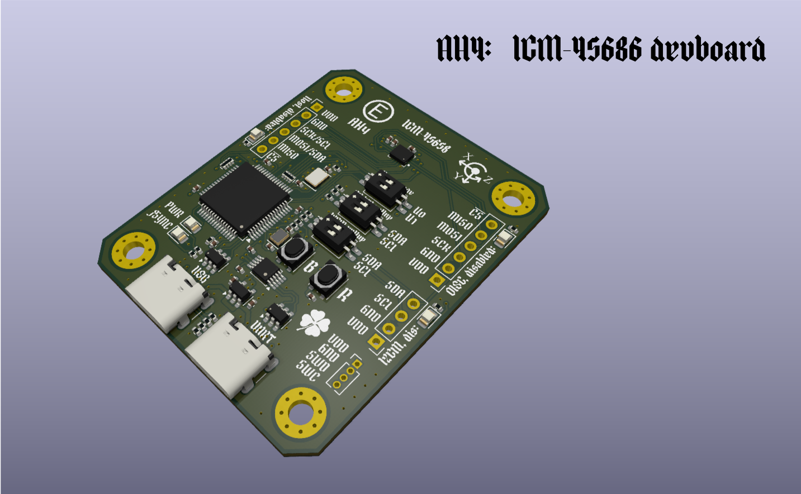
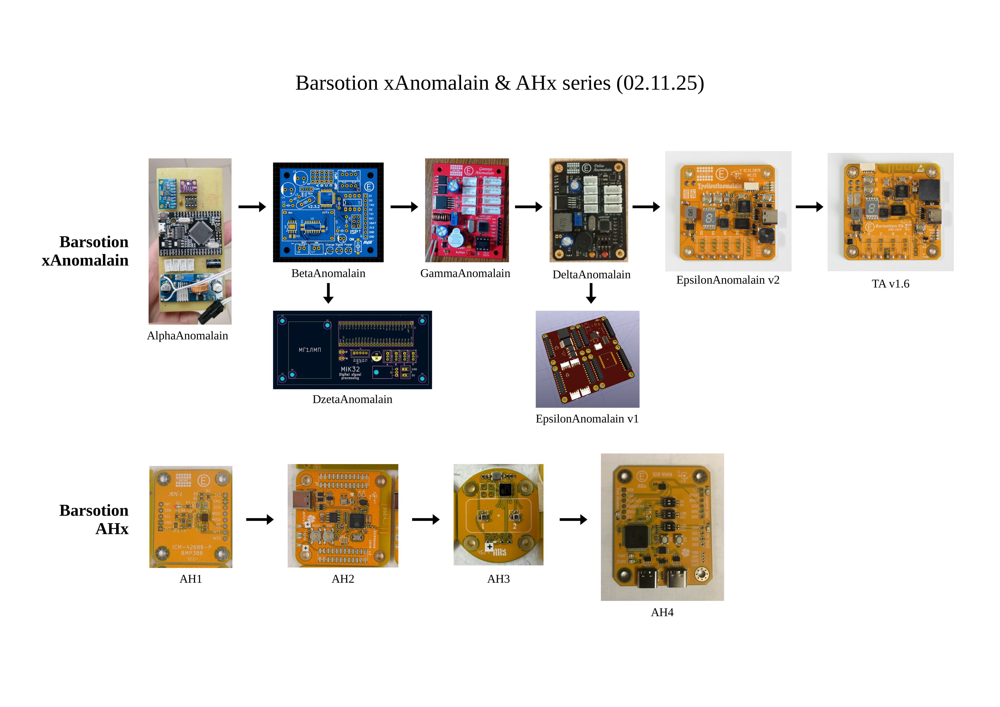

# AH4: ICM-45686 devboard
the 12th board after Berkut

---
## ⚡️Abstract
Development board for ICM-45686 InvenSense TDK gyroscope & accelerometer. You can connect to it's interfaces (AP, OIS, I2CM) or drive them by on-board CH32V305RBT6 microcontroller.

- All ICM-45686 interfaces are routed (AP, OIS, I2CM);
- AP interface can be I2C or SPI
- On-board 32.768 kHz quartz oscillator to stabilize ODR frequency;
- On-board 32-bit RISC-V MCU to simplify ICM-45686 research;
- USB 2.0 HS and USB-UART are routed from the MCU.

---
## ⚡️Continious progress
- [Previous board: Barsotion-TA](https://github.com/Barsy-Barsevich/Barsotion-TA)
- [Previous board: Barsotion-PL1](https://github.com/Barsy-Barsevich/Barsotion-PL1)

